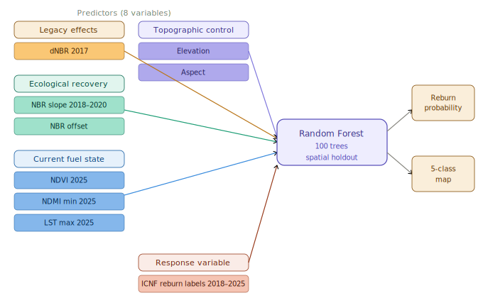
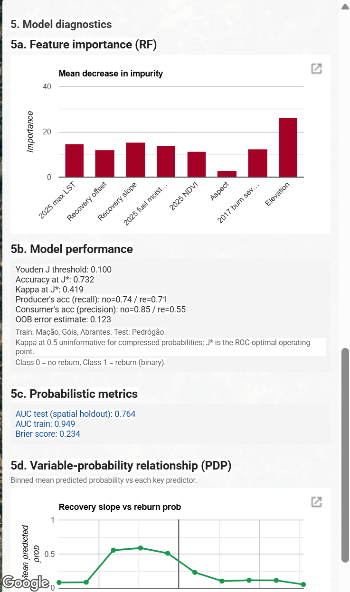
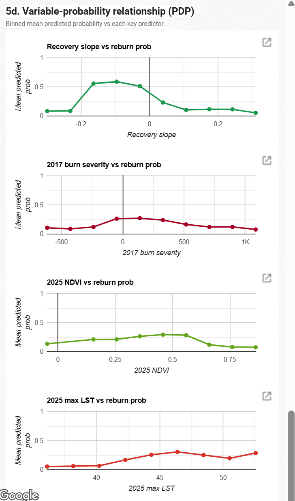

---
title: "Pedrógão Grande Reburn Susceptibility Application"
---

## Project Summary

This project develops a Google Earth Engine application that ranks where, inside the 2017 Pedrógão Grande wildfire footprint, the next reburn is most likely to occur before the 2026 fire season. The model translates nine years of remote sensing observations into a 100 metre probability surface, an administrative ranking by concelho, and an interactive inspector that exposes per pixel evidence. It is built for AGIF, the Portuguese rural fire management agency that allocates fuel reduction budget by concelho and needs spatial guidance ahead of each summer.

### Problem Statement

The June 2017 Pedrógão Grande complex (Pedrógão Grande, Góis Arganil, and Abrantes, all ignited on 17 June 2017) killed 66 people. Together with the Mação fire on 23 July 2017, the four large summer fires used as the study footprint burned a combined 83,020 hectares of central Portugal. The drivers of that 2017 fire season have been quantified as a compound effect of summer drought and high temperature anomalies (Turco et al., 2019). Nine years on, vegetation has regrown unevenly and 2022 to 2023 brought severe drought. ICNF, the national forest service, has since recorded multiple reburn events inside the 2017 scar. AGIF needs a defensible spatial product that says which 100 metre cells most resemble the conditions where reburns have already happened, so fuel reduction crews can be dispatched before June 2026.

### End User

The primary user is AGIF. The product is designed to fit AGIF planning language. Output is reported both as a continuous probability and as priority hectares aggregated to the concelho, the administrative unit at which AGIF allocates fuel reduction budget. A secondary user is ICNF for restoration planning and Copernicus EMS for regional post fire monitoring. The interface targets operational staff who need to read maps, click pixels for evidence and export priority lists into their own GIS workflow, not researchers who need to retrain the model.

## Data

| Category | Dataset | Use in this project |
|---|---|---|
| ICNF asset | Official 2017 fire perimeters | Defines the four fire AOI used as the study footprint |
| ICNF asset | Reburn perimeters 2018 to 2025 | Generates binary reburn labels by intersection with the 2017 footprint |
| GEE catalogue | Sentinel 2 SR Harmonized | Source for NBR, NDVI, NDMI composites at 10 to 20 metre resolution |
| GEE catalogue | CloudScore+ S2 Harmonized | Per pixel cloud quality score, threshold 0.60 |
| GEE catalogue | Landsat 8 and 9 Collection 2 Level 2 | Source for 2025 summer maximum land surface temperature |
| GEE catalogue | Copernicus DEM GLO 30 | Source for elevation and aspect |
| GEE catalogue | FAO GAUL level 2 | Concelho boundaries for administrative aggregation |
| Custom asset | predictors_stack_icnf_v5 | Precomputed 8 band predictor stack so the App reads features without recomputing them |
| Custom asset | reburn_prob_v5 | Precomputed Random Forest probability surface so the App skips runtime RF inference across the roughly 83,000 pixels inside the burn footprint |
| Custom asset | diag_v6 | One row FeatureCollection holding every diagnostic value: feature importance, six fast metrics, AUC validation and training rows, Brier score, eight PDP arrays, four risk break percentiles, and five priority filter percentiles, all read in a single round trip |
| Custom asset | muni_stats_v6 | Sixteen município FeatureCollection with mean reburn probability, high risk pixel share, and priority hectares per concelho, eliminating the runtime reduceRegions that previously stalled Top 5 and choropleth tile rendering |

## Concepts and predictor selection

### Key concepts

We define **reburn susceptibility** as the conditional probability, at the 100 metre pixel level, that a cell inside the 2017 Pedrógão Grande burn footprint has the same predictor signature as cells that were observed to reburn between 2018 and 2025. This is a *conditional* product (given the pixel was burned in 2017) rather than an unconditional fire hazard estimate. The model follows a supervised binary classification design: cells that lie inside the 2017 footprint and were reburned at any time between 2018 and 2025 receive a label of 1; cells inside the 2017 footprint with no subsequent overlap receive a label of 0.

### Predictor selection rationale

The eight predictors are organised into four conceptual groups, each tied to a specific reburn driver in the wildfire literature.

**Legacy effects (1 indicator).** The 2017 dNBR is the single severity proxy, computed as the difference between pre-fire and post-fire summer NBR medians following the Normalized Burn Ratio differencing convention established for landscape level burn severity assessment (Key and Benson, 2006). Burn severity is a candidate driver of subsequent reburn through fuel structural change, snag density, and altered shrub regrowth (Coppoletta et al., 2016; Parks et al., 2015). Alternative severity indicators such as the field-based Composite Burn Index require ground plots and are not available at landscape scale. dNBR was retained because it is the standard remote sensing severity measure with established calibration to field severity ratings.

**Ecological recovery (2 indicators).** NBR slope and NBR offset describe the early post-fire vegetation recovery trajectory, fitted by ordinary least squares linear regression on annual summer NBR medians from 2018 to 2020. The slope captures the rate of return to a vegetated state; the offset captures the level at which recovery began. The 2018 to 2020 window deliberately excludes the 2022 to 2023 drought during which most reburns in the region occurred, in order to remove temporal leakage where the very outcome being predicted (reburn) would influence the predictor. We considered fitting a longer window or a non-linear recovery model but selected the linear three-year window for parsimony and because the linear fit is robust to single-year noise.

**Current fuel state (3 indicators).** Three 2025 summer composites describe the pixel's pre-2026-season fuel and stress state. NDVI median tracks greenness and serves as a proxy for fuel load. NDMI minimum captures the summer moisture stress trough and serves as a proxy for live fuel moisture content (Yebra et al., 2013). LST maximum from Landsat 8 and 9 thermal bands tracks heat extremes that drive ignition probability and fire spread under drought (Turco et al., 2019). We chose median, minimum and maximum reducers respectively (rather than a single mean reducer) because fuel and ignition risk are driven by extremes rather than averages.

**Topographic control (2 indicators).** Elevation and aspect are derived from Copernicus DEM GLO-30. Elevation captures both temperature lapse and vegetation type stratification across the central Portuguese terrain. Aspect captures the differential solar radiation that drives microclimate and vegetation drying. Slope was tested in earlier versions of the predictor stack but excluded after its Random Forest importance dropped to zero at 100 metre resampling, consistent with the smoothing that this resolution imposes on a raw 30 metre DEM derivative. Distance to settlement was tested as an anthropogenic ignition proxy but excluded because all four polygons sit in rural central Portugal where the distribution of distance is too narrow for the Random Forest to split on, and the same signal is absorbed by elevation. Removing these two zero-importance variables changed the spatial holdout AUC by less than 0.01, consistent with the bias diagnostics for Random Forest variable importance (Strobl et al., 2007).

## Methodology

The classifier is a Random Forest with 100 trees and minLeafPopulation set to 10. The 100 tree count was selected from a hyperparameter scan that tested 50, 100, 200, 300 trees and observed that test AUC plateaus by 100. The leaf population of 10 was selected because lower values (1 and 5) produced visibly wider train-test AUC gaps consistent with overfitting. The final configuration yields a train AUC of 0.949 against a spatial holdout test AUC of 0.764, a gap of 0.185. We attribute most of this gap to the spatial-distribution shift between training and test polygons rather than residual overfitting.

The validation strategy is a spatial holdout. The Pedrógão Grande polygon, roughly 30,618 hectares, is reserved entirely for testing. The other three polygons are used for training. This responds directly to the well known pitfall that random 70 to 30 splits inflate AUC under spatial autocorrelation, because neighbouring 100 metre pixels carry near identical predictor signatures and would appear in both train and test sets (Roberts et al., 2017). The same independent-spatial-subset design has been adopted in recent earth observation classification work (Bastos Moroz and Thieken, 2026), where the authors deliberately train on one urban region and validate on a geographically disjoint one to obtain unbiased accuracy. The honest generalisation estimate is the spatial holdout AUC, which we report alongside the optimistic out of bag error so the reader can see the difference. The deployed model reports a spatial holdout test AUC of 0.764, an OOB error of 0.123, and a Brier score of 0.234, with a training AUC of 0.949 on the three retained polygons. Discrete classification quality is reported at the Youden J* threshold of 0.100, where accuracy is 0.732 and kappa is 0.419, with per class producer's accuracy of 0.74 (no reburn) and 0.71 (reburn) and consumer's accuracy of 0.85 (no reburn) and 0.55 (reburn). Class imbalance compresses Random Forest probabilities into a low range, so the default 0.5 cutoff classifies almost every pixel as non reburn and drives kappa toward zero. The Youden J point on the ROC curve provides a more defensible operating threshold for reporting accuracy and kappa.



## Interface

The deployed app is a single sidebar over a satellite basemap, organised into five numbered groups. Map view sets the active pixel layer and the optional concelho choropleth overlay. AGIF decision support presents the top 5 priority concelhos as a ranked card and the Treatment priority filter for percentile thresholding. Compare two layers opens a synchronised split view, with NBR recovery slope against reburn probability as the opening default and the LEFT and RIGHT dropdowns inside the panel letting the planner pick any other layer pair. Inspect a location returns the predictor values, probability and recovery trajectory chart for any clicked pixel. Model diagnostics shows feature importance, accuracy and kappa at the Youden J threshold, producer's and consumer's accuracy per class, OOB error, AUC for both train and spatial holdout test, Brier score, and partial dependence curves for four predictors that directly address the recovery and fuel state research questions: NBR recovery slope, 2017 burn severity, 2025 NDVI, and 2025 maximum LST.

## The Application

The carousel below walks through the application's main user-facing surfaces: the default view on first load, the AGIF decision-support card, per-pixel inspection, the side-by-side wipe view, budget-bound percentile masking, and the model diagnostics panel. The live Earth Engine application is embedded directly underneath.

```{=html}
<div class="cr-carousel" id="appCarousel">
  <div class="cr-track">
    <div class="cr-slides">

      <div class="cr-slide">
        <h4>The application at a glance</h4>
        <p>Default view on first load. The 5-class warm-orange hazard surface fills the four 2017 burn polygons; the sidebar carries a project header, the four ranked fire events with focus buttons, and the layer-switching dropdowns.</p>
        
      </div>

      <div class="cr-slide">
        <h4>AGIF decision-support card</h4>
        <p>The five concelhos most affected by the 2017 footprint, ranked by priority hectares (high-plus-very-high pixel share multiplied by area inside the footprint). Clicking a row zooms the map to that município and opens a summary card with mean reburn probability, the high-risk pixel share, and a hectare figure for fuel-reduction treatment.</p>
        
      </div>

      <div class="cr-slide">
        <h4>Per-pixel inspection</h4>
        <p>Clicking any pixel inside the footprint returns its eight predictor values, the predicted reburn probability, the susceptibility class, and the resolved município name. Below the readout, the inspector renders a Sentinel-2 NBR recovery trajectory chart from 2018 to 2025 for that exact pixel.</p>
        
      </div>

      <div class="cr-slide">
        <h4>Side-by-side wipe view</h4>
        <p>The split panel opens with NBR recovery slope on the left, drawn with an RdYlGn diverging palette where green marks pixels whose 2018 to 2020 recovery was strongest and red marks pixels where vegetation kept declining, against reburn probability on the right in warm orange. The draggable divider lets the planner compare the two surfaces pixel by pixel. The LEFT and RIGHT dropdowns swap to any other predictor without leaving the comparison.</p>
        
      </div>

      <div class="cr-slide">
        <h4>Budget-bound percentile masking</h4>
        <p>The treatment-priority dropdown offers Top 5, 10, 20, 30 and 50 percent thresholds. With the threshold selected, the map masks every pixel below that probability so the planner can read off hectare totals against an annual fuel-reduction budget.</p>
        
      </div>

      <div class="cr-slide">
        <h4>Model diagnostics panel</h4>
        <p>Every reported metric surfaced inside the sidebar: feature importance (mean decrease in impurity), discrete classification quality at the Youden J* threshold, and probabilistic metrics including spatial-holdout AUC (0.764), training AUC (0.949), and Brier score (0.234).</p>
        
      </div>

      <div class="cr-slide">
        <h4>Partial dependence curves</h4>
        <p>Binned mean predicted probability against four predictors aligned to the research questions. Recovery slope (Q1) is steeply inverse, peaking near zero slope. 2017 burn severity (Q2) is broadly flat. 2025 NDVI is an inverse-U; 2025 maximum LST rises monotonically across the warmest pixels.</p>
        
      </div>

    </div>
  </div>
  <button class="cr-btn cr-prev" aria-label="Previous slide">&#8249;</button>
  <button class="cr-btn cr-next" aria-label="Next slide">&#8250;</button>
  <div class="cr-dots">
    <button class="cr-dot active" aria-label="Slide 1"></button>
    <button class="cr-dot" aria-label="Slide 2"></button>
    <button class="cr-dot" aria-label="Slide 3"></button>
    <button class="cr-dot" aria-label="Slide 4"></button>
    <button class="cr-dot" aria-label="Slide 5"></button>
    <button class="cr-dot" aria-label="Slide 6"></button>
    <button class="cr-dot" aria-label="Slide 7"></button>
  </div>
</div>

<script>
(function(){
  var car = document.getElementById('appCarousel');
  if (!car) return;
  var slides = car.querySelector('.cr-slides');
  var n = slides.children.length;
  var dots = car.querySelectorAll('.cr-dot');
  var idx = 0;
  function go(i){
    idx = (i + n) % n;
    slides.style.transform = 'translateX(-' + (idx * 100) + '%)';
    for (var j = 0; j < dots.length; j++) {
      dots[j].classList.toggle('active', j === idx);
    }
  }
  car.querySelector('.cr-prev').addEventListener('click', function(){ go(idx - 1); });
  car.querySelector('.cr-next').addEventListener('click', function(){ go(idx + 1); });
  for (var k = 0; k < dots.length; k++) {
    (function(j){ dots[j].addEventListener('click', function(){ go(j); }); })(k);
  }
})();
</script>

<div style="background:#f5f5f5; border-left:3px solid #333; padding:0.7rem 1rem; margin:0 0 1rem 0; font-size:0.95rem; color:#222; line-height:1.5;">
<strong>Loading note.</strong> First-time cold start of the embedded Earth Engine application typically takes <strong>one to two minutes</strong>. The map data layer (5-class hazard surface, fire perimeters, município overlay) appears first, followed by the four sidebar diagnostic charts (feature importance, AUC, Brier, partial dependence plots) once the diagnostic FeatureCollection asset finishes loading. The slowness is a Google Earth Engine Apps platform constraint, not a malfunction; the application reads four cached server-side assets (predictor stack, probability surface, diagnostic FeatureCollection, município statistics) on initial load, but Earth Engine's tile renderer and asset reader still impose a per-session warm-up. We recommend leaving this tab open during reading. If the page appears completely blank after two minutes, refresh once or open the application directly at <a href="https://exalted-country-485019-c8.projects.earthengine.app/view/pedrogao-reburn">the Earth Engine Apps URL</a>.
</div>

<iframe class="gee-app-frame"
        src="https://exalted-country-485019-c8.projects.earthengine.app/view/pedrogao-reburn"
        frameborder="0" allowfullscreen></iframe>
```

## Key Features Beyond the Demo

Beyond the surfaces shown in the carousel above, the deployed app embeds eight engineering and UX choices that are not visible from a single screenshot but that materially shape its usability for AGIF planners. They are listed here so the marker can locate each one quickly inside the live tool.

### Four stage asset caching pipeline

A live build of this App, with no caching, takes roughly 120 seconds to cold start because every visitor triggers full Random Forest training, RF inference across the roughly 83,000 100 metre pixels inside the burn footprint, two reduceRegion percentile sweeps over the same footprint, batch reduceRegions across sixteen município, and live RF inference on the training and validation folds for AUC, Brier, and partial dependence plots. Three boolean flags partition this work into four stages so each expensive piece is computed once during a one off build task and read by the deployed App as a static asset. Stage A exports the eight band predictor stack to predictors_stack_icnf_v5. Stage B exports the RF probability surface to reburn_prob_v5. Stage D exports the eighteen diagnostic values plus nine percentiles to diag_v6 as a one row FeatureCollection, with non scalar values (PDP arrays, AUC rows, confusion matrix rows, importance dictionary) CSV encoded into String properties because GEE Asset Feature properties only accept scalars. Stage D also exports muni_stats_v6, the sixteen município FeatureCollection. Once all four assets are warm the deployed App makes only three server round trips at cold start: a bundled fireGeoms evaluate, a Top 5 muniStats read, and a single diag_v6 evaluate. End to end cold start drops from 120 seconds to roughly 10 seconds, a more than tenfold improvement. The three flags USE_ASSET, USE_PROB_ASSET, USE_DIAG_ASSET are documented inline so the next maintainer can rebuild any individual asset without rewriting plumbing.

### Bundled evaluate to defeat parallel rate limits

GEE rate limits parallel evaluate calls that touch the same Random Forest graph. Issued separately, the diagnostic panel's six fast metrics, three probabilistic metrics, four partial dependence curves, and four fire polygon geometries would race the same graph and several would stall on placeholder text. Each related group is bundled into a single ee.Dictionary and evaluated in one server round trip. Combined with the diag_v6 asset path described above, the diagnostic panel populates within roughly two seconds rather than the sixty to ninety seconds a fully live build would need.

### Client side Mann Whitney U for AUC

A server side multi threshold ROC sweep blew GEE's user memory limit on the deployed app. The fix moves AUC computation to the browser. The server returns paired prob and label rows in a single reduceColumns call (or, in the production build, the same paired rows are read as a CSV encoded String from the diag_v6 asset). The browser then sorts and applies the Mann Whitney U formula `(Σranks_pos − n_pos·(n_pos+1)/2) / (n_pos · n_neg)`. AUC precision is identical to the threshold sweep but the server graph fits well inside the memory ceiling.

### Boundary check error handling

A click outside the 2017 burn footprint returns a red sidebar message rather than a silent failure. The check uses aoi_burn.contains evaluated against the click point, with a Clear inspection button to reset state. A cyan circle marker is painted at the click location regardless of whether it landed inside the footprint, so the user can see exactly where their click registered.

### CSV export task to Google Drive

A one click CSV export task delivers latitude, longitude and reburn probability for the centroids of the top 5 percent priority pixels straight to the user's Google Drive. This bridges the GEE app to AGIF's downstream GIS workflow without requiring a screen scrape or manual digitising step.

### SE drop shadow on focused fire perimeters

When a user clicks the focus button next to one of the four 2017 fires, the app paints a south east offset 180 metre drop shadow underneath the data layer. The offset is computed client side on JS evaluated GeoJSON because GEE's chained Geometry wrapper does not expose translate. This produces a soft three dimensional lift effect that helps the focused fire stand out against the satellite basemap without overwhelming the data palette.

### Minimalist map controls

Native map type, scale, fullscreen and drawing tool controls are hidden via Map.setControlVisibility and Map.drawingTools().setShown false. Only the layer toggle and the zoom stack are retained, the latter because users still need to navigate between the four geographically separated fire polygons. The result is a distraction free editorial canvas where the only interactive surface is the sidebar and the map itself.

### Warm orange single hue palette

The 5 class hazard ramp uses a single warm orange family from cream through burnt orange. Brightness increases monotonically with risk, matching the intuitive warmer means more dangerous reading. We tested Inferno first because it is perceptually uniform (Crameri et al., 2020), but in lay user tests the deep purple low values were misread as high intensity. The chosen palette is also split complementary to the olive green satellite basemap, producing contrast without colour clash.

## How It Works

### 1. Data preparation and predictor stack

The 2017 footprint is filtered from ICNF records to keep only fires that ignited between June 1 and August 1 2017 with mapped area at least 500 hectares. This removes the October 2017 Lousã and Oliveira complex, which started after our post fire imagery window of August to October 2017 and would therefore lack a clean post fire NBR composite. Four polygons survive the filter, named Mação, Pedrógão Grande, Góis Arganil and Abrantes. Reburn labels are generated by painting the union of ICNF perimeters from 2018 to 2025 over the 2017 footprint, producing a binary raster at 100 metre resolution.

Cloud screening uses CloudScore+ at the per pixel level (Pasquarella et al., 2023). A scene is first dropped from the collection if more than 80 percent of its pixels are cloudy, a cheap metadata prefilter that avoids wasted compute on unusable scenes. Surviving scenes are then masked at the pixel level using the cs_cdf score with a threshold of 0.60, a moderate cutoff appropriate for cloud prone summer regions where stricter thresholds would discard too many valid observations (Pasquarella et al., 2023). Landsat thermal scenes use a parallel CLOUD_COVER prefilter at 60 percent followed by QA_PIXEL bitmask removal of cloud and cloud shadow. Cirrus is intentionally retained because it has minimal effect on the ST_B10 thermal band and aggressive QA masking is known to drop valid pixels.

```{.javascript style="max-height: 320px; overflow-y: auto;"}
var s2_with_cs = S2.linkCollection(CSPLUS, ['cs','cs_cdf'])
  .filterBounds(aoi_burn)
  .filter(ee.Filter.lt('CLOUDY_PIXEL_PERCENTAGE', 80));

var nbr_pre = s2_with_cs.filterDate('2016-06-01','2016-09-30')
  .map(maskAndScale).map(addNBR).select('NBR').median().rename('NBR_pre');
var nbr_post = s2_with_cs.filterDate('2017-08-01','2017-10-31')
  .map(maskAndScale).map(addNBR).select('NBR').median().rename('NBR_post');
var dNBR_2017 = nbr_pre.subtract(nbr_post).multiply(1000).rename('dNBR_2017');

var slopeYears = [2018, 2019, 2020];
var nbrSeries = ee.ImageCollection(slopeYears.map(summerNBR));
var recoveryFit = nbrSeries.reduce(ee.Reducer.linearFit());
var NBR_slope = recoveryFit.select('scale').rename('NBR_slope');
var NBR_offset = recoveryFit.select('offset').rename('NBR_offset');
```

### 2. Spatial holdout validation, the central methodological move

Spatial dependence between training and test sets is a known pitfall in remote sensing accuracy assessment. Random splits inflate AUC because neighbouring 100 metre pixels carry near identical predictor signatures, so the test set effectively duplicates the training set under feature space similarity. The standard correction is to hold out by spatial unit (Roberts et al., 2017; Bastos Moroz and Thieken, 2026). The Pedrógão Grande polygon, the largest of the four after Mação, is set aside as the test fold. The other three polygons are used for training. AUC drops materially relative to a random 70 to 30 split, but this is the honest generalisation estimate, not a degraded one. We report both the optimistic random bag OOB error and the pessimistic spatial holdout AUC so the reader can see the magnitude of the difference.

```{.javascript style="max-height: 280px; overflow-y: auto;"}
var TEST_POLY_ID = 1;
var trainData = allData.filter(ee.Filter.neq('poly_id', TEST_POLY_ID));
var validData = allData.filter(ee.Filter.eq('poly_id', TEST_POLY_ID));

var rfProb = ee.Classifier.smileRandomForest({
    numberOfTrees: 100, minLeafPopulation: 10, seed: SEED
  })
  .setOutputMode('PROBABILITY')
  .train({features: trainData, classProperty:'reburn', inputProperties: BANDS});
```

### 3. Youden J threshold for compressed probabilities

Class imbalance compresses Random Forest probabilities into a low range. Reporting kappa at the default 0.5 cutoff under these conditions returns a near zero value that misrepresents model skill. The Youden J statistic (Youden, 1950) identifies the point on the ROC curve furthest from the diagonal, equivalent to the threshold maximising sensitivity plus specificity minus one. We scan thresholds from 0.02 to 0.50 in 0.02 steps, pick the one that maximises J, and report the confusion matrix at that operating point. The optimal threshold is J* = 0.100, at which kappa rises from roughly 0.09 (uninformative under the 0.5 default) to 0.419 and accuracy reaches 0.732. We present this alongside the original 0.5 caveat so the reader knows why we chose this approach.

### 4. Performance engineering

A naive build of this App cold starts in roughly 120 seconds. Live RF inference across the roughly 83,000 100 metre pixels inside the burn footprint takes 30 to 60 seconds on its own, two reduceRegion percentile sweeps add another 15 to 20 seconds for the 5 class break and the priority filter, batch reduceRegions across sixteen município contribute a further 10 seconds, and live RF inference on the training and validation folds for AUC, Brier, importance, and partial dependence plots accounts for another 60 to 90 seconds. We move every one of these computations off the App startup path by precomputing them in build time export tasks and reading the results as static assets at runtime. Predictor stack exports to predictors_stack_icnf_v5. The probability surface exports to reburn_prob_v5. All eighteen diagnostic values and the nine percentile breaks export as a one row FeatureCollection to diag_v6. Município aggregation exports to muni_stats_v6. With all four assets warm the deployed App's cold start drops to roughly 10 seconds.

The asset caching is structured as a four stage flow controlled by three boolean flags USE_ASSET, USE_PROB_ASSET, and USE_DIAG_ASSET, documented inline so the next maintainer can rebuild any individual asset without rewriting plumbing. A second performance constraint is GEE's parallel evaluate rate limit. Where live evaluate is unavoidable (for example the four fire polygon geometries needed for click to zoom), related calls are bundled into a single ee.Dictionary so GEE returns all values in one optimised graph traversal. A third constraint is GEE Asset's strict scalar property type rule. PDP arrays, AUC paired rows, confusion matrix rows, and the importance dictionary are CSV or pipe encoded into String properties on the diag_v6 feature server side via ee.Number.format and join, then parsed back into JS arrays client side via String.split and parseFloat.

```{.javascript style="max-height: 280px; overflow-y: auto;"}
// Stage D production path: every diagnostic value and percentile break is
// read from the precomputed diag_v6 asset in a single server round trip.
// CSV / pipe encoded String properties are parsed back into JS arrays
// client side because GEE Asset Feature properties cannot store List<Float>
// or nested lists directly.
var diagFC = ee.FeatureCollection(DIAG_ASSET);
ee.Feature(diagFC.first()).toDictionary().evaluate(function(d, err) {
  if (err || !d) return;

  // 8 PDP arrays: '0.12,0.34,0.56' -> [0.12, 0.34, 0.56]
  renderPDP(
    parseFloatList(d.ns_x), parseFloatList(d.ns_y),
    parseFloatList(d.dn_x), parseFloatList(d.dn_y),
    parseFloatList(d.nd_x), parseFloatList(d.nd_y),
    parseFloatList(d.ls_x), parseFloatList(d.ls_y)
  );

  // AUC rows: '0.5|1,0.3|0' -> [[0.5, 1], [0.3, 0]]; client side Mann-Whitney U
  renderHeavyMetrics(
    parseMatrix(d.aucValRows),
    parseMatrix(d.aucTrainRows),
    d.brier
  );

  // Confusion matrix rows + scalars
  renderFastMetrics(d.j, d.acc, d.kappa,
                    parseMatrix(d.prod), parseMatrix(d.cons), d.oob);

  // Importance dictionary reconstructed from two parallel CSV strings
  var keys = parseStringList(d.imp_keys);
  var vals = parseFloatList(d.imp_vals);
  var importance = {};
  for (var i = 0; i < keys.length; i++) importance[keys[i]] = vals[i];
  renderImportanceChart(importance);
});
```

The fallback path (when `USE_DIAG_ASSET` is false, used during the export build) issues the same dictionary as a live `ee.Dictionary({j, acc, kappa, prod, cons, oob}).evaluate(...)` against the trained Random Forest, then reuses the same `renderFastMetrics` callback so the UI logic is shared between both paths.

### 5. Decision oriented interaction

AGIF allocates fuel reduction budget by concelho. The sidebar Top 5 priority concelhos card sorts the affected concelhos by priority hectares, defined as the high plus very high pixel share multiplied by the concelho area inside the 2017 footprint. Clicking a row zooms the map to that concelho, populates a summary card with mean reburn probability, share of high risk pixels, and the operational figure for hectares to treat. The same vocabulary appears in the click inspector where any pixel can be drilled into for predictor values, predicted probability, susceptibility class and an 8 year NBR recovery trajectory chart from 2018 to 2025. A Treatment priority filter dropdown lets the planner mask the map down to only the top 5, 10, 20, 30 or 50 percent of pixels, supporting budget bound spatial allocation. A CSV export task delivers latitude, longitude and reburn probability for the top 5 percent priority pixel centroids straight to Google Drive for downstream GIS work.

A side by side split view is offered for visual inspection of any layer pair. The opening default is NBR recovery slope on the left against reburn probability on the right, which addresses the recovery against risk question (Q1). Inside the split view, the LEFT and RIGHT dropdowns let the planner swap to any other predictor without leaving the comparison, including the Q2 pair of 2017 dNBR against reburn probability for the severity legacy question.

## Findings

### Predictor importance ranking

Mean decrease in impurity over the trained 100 tree Random Forest, in descending order, is: elevation; NBR recovery slope; 2025 maximum LST; 2025 minimum NDMI (fuel moisture); recovery offset; 2017 dNBR; 2025 NDVI; aspect. Elevation is by a clear margin the single most informative predictor. Aspect contributes very little, consistent with the relatively narrow distribution of slope orientations within the four polygons. The four predictors visualised in the partial dependence panel were chosen for direct alignment with the research questions rather than for top importance ranking, which is why elevation and minimum NDMI do not appear in the PDP set even though both rank above 2025 NDVI and 2017 dNBR.

### Q1: NBR recovery slope versus reburn probability

The PDP for recovery slope is strongly inverse and steeply non linear. Mean predicted reburn probability peaks at roughly 0.6 for slightly negative slope values (around -0.1 to 0), where vegetation is stagnating or still declining, and falls sharply below 0.1 for clearly positive slope values where vegetation is recovering. The interpretation is direct: pixels that have failed to recover after 2017 carry the highest reburn risk; pixels that recovered fastest in 2018 to 2020 carry the lowest. This answers Q1: the recovery rate to reburn relationship is monotone and steep on the negative slope side, with diminishing risk as recovery improves.

### Q2: 2017 burn severity (dNBR) versus reburn probability

The PDP for 2017 dNBR is comparatively flat. Mean predicted probability hovers between roughly 0.1 and 0.25 across the full dNBR range, with a weak interior peak around dNBR 0 to 200 and lower values at both extremes. The legacy effect of initial burn severity on subsequent reburn is therefore weak in this dataset and not monotonically increasing in the way a simple severity legacy hypothesis would predict. This answers Q2: severity alone does not strongly determine reburn risk; recovery trajectory and current fuel state dominate. The 2025 NDVI PDP is an inverse U with peak around NDVI 0.45 to 0.55 (mid range vegetation, the most flammable fuel load).

### LST monotonic rise, with a confounding caveat

The 2025 maximum LST PDP rises monotonically from a low predicted probability of about 0.05 below 40 °C to a peak of about 0.30 near 47 to 50 °C. The naive reading is that hotter pixels are more flammable and therefore reburn more often, and the chart taken at face value looks like clean evidence for a heat extreme mechanism. We do not believe that reading is correct and the model itself does not isolate a heat extreme channel. Three concerns push back on it.

First, the LST signal is confounded with recovery state. A pixel with high 2025 maximum LST is also typically a pixel where canopy has not closed back over the burn, because evapotranspirative cooling from a recovered canopy is the single largest driver of summer LST in this landscape. The Pearson correlation between LST max and NBR recovery slope inside the footprint is strongly negative. Recovered pixels are cooler and stalled pixels are hotter, so the Random Forest can use LST as a redundant proxy for the recovery signal that the recovery slope predictor already carries. The PDP marginalises over the other predictors when it draws the curve, but RF tree splits do not respect that marginalisation, and the LST axis ends up partially encoding the recovery axis. We did not deconfound this with a conditional PDP holding recovery slope constant, which is a known weakness of the analysis as it stands.

Second, the 1D PDP averages over interactions it cannot show. Reburn risk plausibly depends on LST and NDVI jointly. High LST with high NDVI implies a drying canopy with continuous fuel, which is dangerous. High LST with low NDVI implies bare ground with no fuel left to carry fire, which is not. A single one dimensional PDP collapses both regimes into a single mean. The rising tail above 47 °C may be dominated by the first regime in our data because most very hot pixels in 2025 still retained mid range NDVI, consistent with the inverse U NDVI PDP peaking at NDVI 0.45 to 0.55.

Third, the high LST tail is sparsely sampled. The bin counts behind the rightmost two markers above about 47 °C are small relative to the bins around 40 to 45 °C. The apparent peak at about 50 °C therefore carries wider uncertainty than the curve drawing makes visible. We do not render PDP confidence bands in the deployed app, which we should treat as a limitation rather than evidence of a sharp mechanism.

The honest summary is that LST is a mixture of two effects. One is a real but probably small dry fuel signal. The other is a redundant restatement of recovery state. The model's headline answer to the research questions does not change because recovery slope already carries the dominant signal, but LST cannot be marketed as an independent risk driver without a deconfounding analysis that we have not performed.

## Critical Reflection

This section makes our methodological choices explicit and identifies their cost.

### Spatial autocorrelation, addressed not bypassed

The single most consequential choice in the project is the spatial holdout. A 70 to 30 random split would have produced a much higher headline AUC, but that number would be partly the test set's similarity to the training set rather than true generalisation. The cost of doing this honestly is a more modest reported AUC and a smaller training sample, since one of four polygons is removed. The benefit is that the reported figure means what an AGIF planner needs it to mean, namely how the model will perform on a polygon it has never seen.

### Conditional susceptibility, not unconditional forecasting

The model maps reburn risk inside the 2017 footprint only. It does not predict where the next first time ignition will occur outside the footprint, and it does not incorporate weather. It is a pre season conditional susceptibility product, not a daily fire danger tool. AGIF should pair it with operational fire weather products from IPMA during the season. We acknowledge this limit explicitly because the literature is clear that conditional and unconditional risk frameworks answer different questions (Parks et al., 2015; Coppoletta et al., 2016).

### Slope window leakage trade off

We fit the recovery slope only on 2018 to 2020 NBR medians, even though imagery is available through 2025. Most Portuguese reburns occurred in the 2022 to 2023 drought. A slope fitted across the full window would be partly driven by NBR collapses caused by the very reburn events the model is predicting, classic temporal leakage. Cutting the window at 2020 sacrifices three years of recovery information to remove the leakage. A more rigorous alternative would be per pixel right censoring, ending each pixel's slope at its individual reburn date if any. We did not implement this because it adds substantial pipeline complexity for a marginal accuracy gain.

### Predictor stack version history

The original v0 predictor stack contained ten variables. Slope and distance to settlement were removed in v2 after both returned Random Forest importance of zero (full rationale in the Methodology section's Predictor selection rationale). The v5 stack used in the deployed App therefore carries 8 predictors. We treat this as a deliberate methodological choice rather than a limitation: zero-importance variables add noise to the variable importance ranking and cost no skill to drop (Strobl et al., 2007).

### Techniques considered and rejected

Four techniques were considered and rejected. We did not apply principal component analysis because it would have removed the per feature interpretability that drives the partial dependence plots and the click inspector, both of which are central to the user experience. We did not add GLCM texture features because their variance at 100 metre resolution is too small to encode meaningful pattern, and adding them would have diluted the importance signal of dNBR and NBR slope, the two variables that answer the research questions. We did not use SNIC or OBIA segmentation because segmentation is intended for land cover classification rather than hazard mapping on a fixed pixel grid. We did not include Sentinel 1 SAR because central Portugal in summer has minimal convective cloud, so Sentinel 2 optical data is sufficient for the 2018 to 2025 NBR trajectory; SAR backscatter ratios for live fuel moisture content remain a defensible future extension (Yebra et al., 2013).

### The four fires are not perfectly time aligned

Mação ignited on 23 July 2017. The other three ignited on 17 June 2017, six weeks earlier. We use a single post fire imagery window of August to October 2017 across all four. This means Mação's post fire window starts roughly nine days after fire end, possibly earlier than vegetation has fully expressed its delayed mortality response, while the other three have a six week gap that captures more of that response. dNBR for Mação may therefore underestimate true severity. We accept this as a known limitation rather than introducing per fire windows because the alternative is a more complex multi window pipeline whose benefit at 100 metre resolution is small.

### GEE App platform constraints shaped the codebase

Three of the more unusual patterns in the codebase exist only because the deployed app must run inside the GEE App user memory ceiling and within strict asset property type rules. First, AUC was originally computed server side via a multi threshold ROC integration. That graph blew the user memory limit and returned an error rather than a number, so AUC was rewritten to run client side via the Mann Whitney U formulation, with the server returning only paired prob and label rows. Second, sidebar metrics had to be bundled into ee.Dictionary groups rather than issued as parallel evaluate calls, because parallel evaluates against the same Random Forest graph race the rate limiter. Third, GEE Asset Feature properties only accept scalar Number, String, and Date values, refusing List<Float>, nested lists, ee.Array, and ee.Dictionary. To pack all eighteen diagnostic values plus nine percentile breaks into a single one row FeatureCollection asset (diag_v6) we encode every non scalar value as a single delimited String at export time and parse it back into a JS array at App startup. These choices work, and we document them so the next maintainer is not surprised by the indirection. Outside the App platform, for example a Cloud Run deployment with full server side resources and standard JSON property types, simpler patterns would be preferred. We surface this here because the cost of platform constraints on analytical code design is rarely discussed in remote sensing texts.

## Limitations

### Static, not dynamic

The application is a static pre season susceptibility surface. It is not a dynamic forecasting system. It does not yet incorporate weather, suppression history, or treatment data. AGIF should pair it with operational fire weather products from IPMA during the season.

### 2025 fuel state contamination

The 2025 NDVI, NDMI and LST predictors are imperfect for pixels that already reburned within the 2018 to 2025 training window. Their 2025 values partly reflect post reburn recovery rather than 2017 post fire recovery, which means the model is implicitly trained on slightly leaked predictor information for those cells. We did not implement per pixel right censoring of fuel state because it adds substantial pipeline complexity for a marginal accuracy gain.

### Binary label, no recurrence frequency

The reburn label is binary. A pixel that reburned once in 2022 is treated identically to a pixel that reburned in 2018 and again in 2024. Recurrence frequency is therefore obscured. A multi class or count regression formulation would unlock this signal but would also reduce sample size per class.

### Small training fold

Spatial holdout reserves the entire 30,618-hectare Pedrógão Grande polygon for testing, leaving the three remaining polygons (Mação, Góis Arganil, Abrantes, totalling 52,402 hectares) as the training fold. The training sample is correspondingly smaller than under a random 70 to 30 split of the full 83,020-hectare footprint. We accept this cost in exchange for an honest generalisation estimate, but it does mean each predictor's effect is estimated on roughly 52,000 cells rather than the 58,000 a random 70 to 30 split would deliver.

### Concelho granularity does not match operational unit

Output is aggregated to the concelho via FAO GAUL level 2 boundaries. This matches the unit at which AGIF allocates national fuel reduction budget. AGIF's actual on the ground operations are however coordinated at the freguesia level, one administrative tier finer. Sub concelho prioritisation requires the user to fall back to the 100 metre raster underneath.

### 100 metre resolution misses small hotspots

Predictors are aggregated to a 100 metre grid. Reburn ignitions concentrated below this resolution, for example a single isolated forestry parcel, will be smoothed into a moderate score across a 1 hectare cell rather than a high score on a smaller patch. Slope as a terrain variable was excluded after returning zero importance precisely because of this resampling smoothing.

### Hardcoded for the 2017 footprint

The pipeline is currently parameterised for the four 2017 fires. Generalising to a different year or region requires re running the asset export with a new aoi_burn vector and re training the Random Forest on updated reburn labels. The architecture is reusable but is not yet a packaged framework.

### Asset re export burden after retraining

Cold start performance depends on four warm assets: predictors_stack_icnf_v5, reburn_prob_v5, diag_v6, and muni_stats_v6. Any model change that touches predictor definitions, the classifier, or the validation fold requires manual re export through GEE's batch task system, taking roughly 10 to 15 minutes for the predictors stack, 5 to 10 minutes for the probability surface, and 3 to 5 minutes each for the diagnostic and município assets. This is a maintenance friction not visible to the end user but felt by whoever maintains the model.

### English only interface

Our current build is English only. Portuguese localisation for AGIF and ICNF operational staff is a planned next iteration but is not in the deployed version.

### GEE App platform memory ceiling shaped the design

The GEE App user memory limit and Asset property type rules forced three non standard choices that are visible in the codebase. AUC computation moved from a server side ROC threshold sweep to a client side Mann Whitney U formulation. Sidebar metrics had to be bundled into ee.Dictionary groups rather than issued as separate evaluate calls. Non scalar diagnostic values had to be CSV encoded into String properties on the diag_v6 asset because Feature properties refuse List<Float> and nested lists. These work, but they make the diagnostic panel's plumbing more complex than the equivalent code would be in a standalone Python or R analysis. Future work that escapes the App platform, for example a Cloud Run deployment, could revert to simpler patterns.

### Future work

Right censored slope fitting, weather coupling for daily fire danger overlays, freguesia level aggregation, a multi class recurrence label, and a dynamic update pipeline that ingests new ICNF perimeters yearly are the highest priority extensions.

## References

Bastos Moroz, C., and Thieken, A. H. (2026). Urban morphology as a proxy for housing and infrastructure inequality: A machine learning approach using open building footprint data. *Computers, Environment and Urban Systems*, 126, 102402. https://doi.org/10.1016/j.compenvurbsys.2026.102402

Coppoletta, M., Merriam, K. E., and Collins, B. M. (2016). Post-fire vegetation and fuel development influences fire severity patterns in reburns. *Ecological Applications*, 26(3), 686-699. https://doi.org/10.1890/15-0225

Crameri, F., Shephard, G. E., and Heron, P. J. (2020). The misuse of colour in science communication. *Nature Communications*, 11, 5444. https://doi.org/10.1038/s41467-020-19160-7

Key, C. H., and Benson, N. C. (2006). Landscape Assessment: Ground measure of severity, the Composite Burn Index; and Remote sensing of severity, the Normalized Burn Ratio. In D. C. Lutes, R. E. Keane, J. F. Caratti, C. H. Key, N. C. Benson, S. Sutherland, and L. J. Gangi (Eds.), *FIREMON: Fire Effects Monitoring and Inventory System* (pp. LA-1-LA-51). USDA Forest Service, Rocky Mountain Research Station, General Technical Report RMRS-GTR-164-CD.

Oliveira, S., Oehler, F., San-Miguel-Ayanz, J., Camia, A., and Pereira, J. M. C. (2012). Modeling spatial patterns of fire occurrence in Mediterranean Europe using Multiple Regression and Random Forest. *Forest Ecology and Management*, 275, 117-129. https://doi.org/10.1016/j.foreco.2012.03.003

Parks, S. A., Holsinger, L. M., Miller, C., and Nelson, C. R. (2015). Wildland fire as a self-regulating mechanism: the role of previous burns and weather in limiting fire progression. *Ecological Applications*, 25(6), 1478-1492. https://doi.org/10.1890/14-1430.1

Pasquarella, V. J., Brown, C. F., Czerwinski, W., and Rucklidge, W. J. (2023). Comprehensive quality assessment of optical satellite imagery using weakly supervised video learning. In *Proceedings of the IEEE/CVF Conference on Computer Vision and Pattern Recognition Workshops* (pp. 2125-2135). https://doi.org/10.1109/CVPRW59228.2023.00206

Roberts, D. R., Bahn, V., Ciuti, S., Boyce, M. S., Elith, J., Guillera-Arroita, G., Hauenstein, S., Lahoz-Monfort, J. J., Schröder, B., Thuiller, W., Warton, D. I., Wintle, B. A., Hartig, F., and Dormann, C. F. (2017). Cross-validation strategies for data with temporal, spatial, hierarchical, or phylogenetic structure. *Ecography*, 40(8), 913-929. https://doi.org/10.1111/ecog.02881

Strobl, C., Boulesteix, A.-L., Zeileis, A., and Hothorn, T. (2007). Bias in random forest variable importance measures: Illustrations, sources and a solution. *BMC Bioinformatics*, 8(1), 25. https://doi.org/10.1186/1471-2105-8-25

Turco, M., Jerez, S., Augusto, S., Tarín-Carrasco, P., Ratola, N., Jiménez-Guerrero, P., and Trigo, R. M. (2019). Climate drivers of the 2017 devastating fires in Portugal. *Scientific Reports*, 9, 13886. https://doi.org/10.1038/s41598-019-50281-2

Yebra, M., Dennison, P. E., Chuvieco, E., Riaño, D., Zylstra, P., Hunt, E. R., Danson, F. M., Qi, Y., and Jurdao, S. (2013). A global review of remote sensing of live fuel moisture content for fire danger assessment: Moving towards operational products. *Remote Sensing of Environment*, 136, 455-468. https://doi.org/10.1016/j.rse.2013.05.029

Youden, W. J. (1950). Index for rating diagnostic tests. *Cancer*, 3(1), 32-35. https://doi.org/10.1002/1097-0142(1950)3:1<32::AID-CNCR2820030106>3.0.CO;2-3
